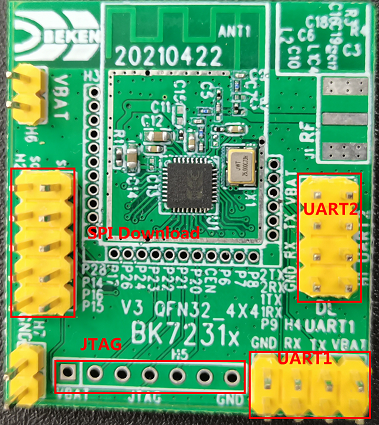

*******************
Demo Board Overview
*******************

BK7231N
----------------

BK7231N is a 2.4 GHz 802.11n and BLE 5.1 full feature comb chip with multi-media feature. It integrates hardware and software component to finish a complete 802.11b/g/n application, which supports AP and STA role simultaneously, and integrates Bluetooth Low Energy 5.1 transceiver and protocol stack. The 120 MHz MCU and embedded 256 KB RAM make it able to support multiple cloud links and also suitable for audio and image application.

    BK7231N Demo Board

BK7251
-------------------

BK7251 is a 2.4 GHz 802.11n and BLE 4.2 comb chip with audio peripheral. It integrates hardware and software component to finish a complete 802.11b/g/n audio application, which supports AP and STA role simultaneously, and integrates Bluetooth low energy 4.2 transceiver and protocol stack. The 180 MHz MCU and embedded 512 KB RAM make it able to support multiple cloud links and also suitable for audio and image application.

    BK7251 Demo Board

BK7231U
-----------

BK7231U is a 2.4 GHz 802.11n and BLE 4.2 full feature comb chip with multi-media feature. It integrates hardware and software component to finish a complete 802.11b/g/n application, which supports AP and STA role simultaneously, and integrates Bluetooth Low Energy 4.2 transceiver and protocol stack. The 120 MHz MCU and embedded 256 KB RAM make it able to support multiple cloud links and also suitable for audio and image application.

    BK7231U Demo Board

