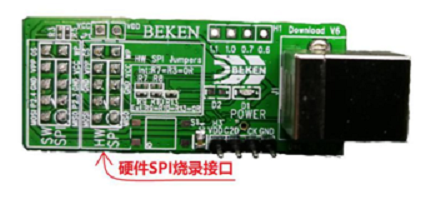
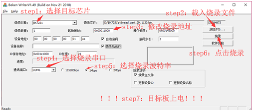

***********
Download
***********

Hardware Tools
---------------

SPI flasher
***************

    SPI Flasher

For chips that don¡¯t have bootrom and no bootloader in flash, you need to use SPI to download firmware. After bootloader has been downloaded into flash, you can use UART to downloadfirmware later. For chips that have bootrom(BK7231N, etc), you can use SPI or UART to download firmware.

UART TTL
*************

.. figure:: ../_static/download_tool_uart.png
    :align: center
    :alt: Uart
    :figclass: align-center

    UART

Make sure chip supports bootrom or its flash has bootloader. We recommend CH340 UART to download firmware.

Software Download tools
-------------------------

+---------------------------+------------------------------------------------------------------------------+
| Tool                      | Description                                                                  |
+===========================+==============================================================================+
| BekenProgram<VERSION>exe  | this tool is used to download firmware via SPI flasher                       |
+---------------------------+------------------------------------------------------------------------------+
| bk_writer_<VERSION>.exe   | this tool is used to download firmware via UART                              |
+---------------------------+------------------------------------------------------------------------------+

Download firmware
-----------------------

Download via SPI
************************

.. figure:: ../_static/download_spi_step1.png
    :align: center
    :alt: HID Download Tool GUI
    :figclass: align-center

    HID Download Tool GUI

After click Download, a progress bar will display.

    SPI Download Progress

Download via UART
********************

Make sure chip supports bootrom or its flash has bootloader. We recommend CH340 UART to download firmware. 

    bkwriter GUI

After click Burn, power off and on the device to let the device enter bootrom or bootloader.

.. note::
  - For chip BK7231N, choose the burn target be BK7231N, BK7231 for other chips.
  - For chip BK7231N, start address is 0x0, other chips are 0x11000.

